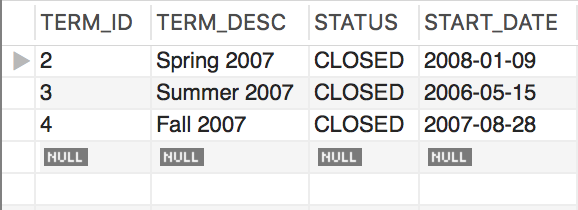
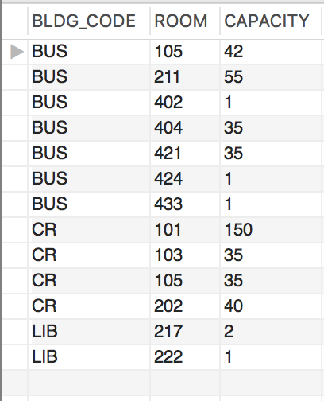
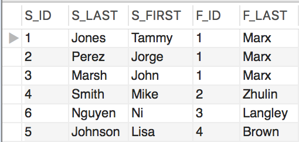
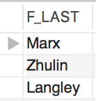
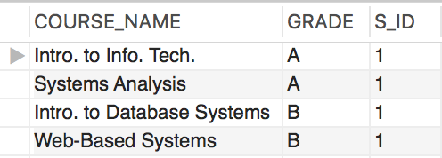

# SQL LAB ASSIGNMENT

**Name:** _Gilberto Diaz, Ash Yenamandra_

**Professor:** _Dr. Fortune Mhlanga Ph. D_

**Course:** _Principle of Data Science MSDS5013_
<!-- TOC -->

- [SQL LAB ASSIGNMENT](#sql-lab-assignment)
- [Lipscomb Database](#lipscomb-database)
    - [Question 1: Defining The Database](#question-1-defining-the-database)
        - [Create database code](#create-database-code)
        - [Primary and Foreign Key's Table](#primary-and-foreign-keys-table)
        - [Foreign Key's Deletes and Updates](#foreign-keys-deletes-and-updates)
        - [Variable Attributes](#variable-attributes)
    - [Question 2: Populating Your Database](#question-2-populating-your-database)
    - [Question 3: Checking Your Database](#question-3-checking-your-database)
    - [Question 4: Simple Database Queries](#question-4-simple-database-queries)
    - [Question 5: Slightly Complex Database Queries](#question-5-slightly-complex-database-queries)
    - [Question 6: Experimenting with Views](#question-6-experimenting-with-views)
    - [Question 7: Updating the Database](#question-7-updating-the-database)

<!-- /TOC -->
# Lipscomb Database

> The current `README.md` file have all the steps the team took to complete the SQL Lab Assignment. Also, the `create_db.sql` file has comments explaining the selection of `pk`, `fk`, and the referential integrity constraints.

## Question 1: Defining The Database

### Create database code

```sql
CREATE DATABASE IF NOT EXISTS LIPSCOMB;

USE LIPSCOMB;


/* ---------- LISPCOMB DB ---------- */


/*---------- COURSE TABLE ----------
pk: COURSE_ID | Unique identifier for the COURSE table.
                COURSE_SEC table will use COURSE_ID
                as fk.
fk: none
ric:
    on update: none
    on delete: none
*/
CREATE TABLE `COURSE` (
    `COURSE_ID` INTEGER PRIMARY KEY AUTO_INCREMENT,
    `COURSE_NO` VARCHAR(10) NOT NULL,
    `COURSE_NAME` VARCHAR(50) NOT NULL,
    `CREDITS` TINYINT NOT NULL
);


/*---------- LOCATION TABLE ----------
pk: LOC_ID | Unique identifier for LOCATION table.
             FACULTY and COURSE_SEC tables will 
             use LOC_ID as fk.
fk: none
ric:
    on update: none
    on delete: none
*/
CREATE TABLE `LOCATION` (
    `LOC_ID` INTEGER PRIMARY KEY AUTO_INCREMENT,
    `BLDG_CODE` VARCHAR(10) NOT NULL,
    `ROOM` VARCHAR(5) NOT NULL,
    `CAPACITY` INTEGER NOT NULL
);


/*---------- FACULTY TABLE ----------
pk: F_ID | Unique identifier for FACULTY table.
           STUDENT will use F_ID as fk.
fk: LOC_ID, F_SUPER
ric:
    on update: cascade | will update the student table and course_section table.
    on delete: restrict | delete is restricted for location table since
                         LOC_ID is assigned to faculty members as fk.
                         F_SUPER links back to F_ID.
*/
CREATE TABLE `FACULTY` (
    `F_ID` INTEGER PRIMARY KEY AUTO_INCREMENT,
    `F_LAST` VARCHAR(50) NOT NULL,
    `F_FIRST` VARCHAR(50) NOT NULL,
    `F_MI` VARCHAR(1),
    `F_PHONE` VARCHAR(15),
    `F_RANK` VARCHAR(30) NOT NULL,
    `F_SUPER` INTEGER,
    `F_PIN` VARCHAR(10) NOT NULL,
    `LOC_ID` INTEGER,
    FOREIGN KEY (`LOC_ID`)
        REFERENCES location (`LOC_ID`)
        ON UPDATE CASCADE 
        ON DELETE RESTRICT
);


/*---------- STUDENT TABLE ----------
pk: S_ID
fk: F_ID
ric:
    on update: cascade  | will update the faculty table and enrollment table.
    on delete: restrict | delete is restricted to the FACULTY table since 
                         F_ID is a fk in STUDENT table.
*/
CREATE TABLE `STUDENT` (
    `S_ID` INTEGER PRIMARY KEY AUTO_INCREMENT,
    `S_LAST` VARCHAR(50) NOT NULL,
    `S_FIRST` VARCHAR(50) NOT NULL,
    `S_MI` VARCHAR(1) NOT NULL,
    `S_ADDRESS` VARCHAR(75) NOT NULL,
    `S_CITY` VARCHAR(50) NOT NULL,
    `S_STATE` VARCHAR(2) NOT NULL,
    `S_ZIP` VARCHAR(5) NOT NULL,
    `S_PHONE` VARCHAR(15) NOT NULL,
    `S_CLASS` VARCHAR(5) NOT NULL,
    S_DOB DATE NOT NULL,
    `S_PIN` VARCHAR(4) NOT NULL,
    `DATE_ENROLLED` DATE,
    `F_ID` INTEGER,
    FOREIGN KEY (`F_ID`)
        REFERENCES FACULTY (`F_ID`)
        ON UPDATE CASCADE 
        ON DELETE RESTRICT
);


/*---------- TERM TABLE ----------
pk: TERM_ID
fk: none
ric:
    on update: none
    on delete: none
*/
CREATE TABLE `TERM` (
    `TERM_ID` INTEGER PRIMARY KEY AUTO_INCREMENT,
    `TERM_DESC` VARCHAR(20) NOT NULL,
    `STATUS` VARCHAR(6) NOT NULL,
    `START_DATE` DATE NOT NULL
);


/*---------- COURSE_SECTION TABLE ----------
pk: C_SEC_ID
fk: COURSE_ID, TERM_ID, F_ID, LOC_ID
ric:
    on update: cascade   | update will update the enrollment table.
    on delete: no action | delete has no action on tables COURSE,
                           TERM, FACULTY and LOCATION. Each
                           section depend on all 4 fk.
*/
CREATE TABLE `COURSE_SECTION` (
    `C_SEC_ID` INTEGER PRIMARY KEY AUTO_INCREMENT,
    `COURSE_ID` INTEGER NOT NULL,
    `TERM_ID` INTEGER NOT NULL,
    `SEC_NUM` INTEGER NOT NULL,
    `F_ID` INTEGER NOT NULL,
    `MTG_DAYS` VARCHAR(7) NOT NULL,
    `START_TIME` TIME NOT NULL,
    `END_TIME` TIME NOT NULL,
    `LOC_ID` INTEGER,
    `MAX_ENRL` INTEGER,
    FOREIGN KEY (`COURSE_ID`)
        REFERENCES course (`COURSE_ID`)
        ON UPDATE CASCADE 
        ON DELETE NO ACTION,
    FOREIGN KEY (`TERM_ID`)
        REFERENCES term (`TERM_ID`)
        ON UPDATE CASCADE 
        ON DELETE NO ACTION,
    FOREIGN KEY (`F_ID`)
        REFERENCES faculty (`F_ID`)
        ON UPDATE CASCADE 
        ON DELETE NO ACTION,
    FOREIGN KEY (`LOC_ID`)
        REFERENCES location (`LOC_ID`)
        ON UPDATE CASCADE 
        ON DELETE NO ACTION
);


/*---------- ENROLLMENT TABLE ----------
pk: enr_id
fk: s_id, c_sec_id
ric:
    on update: cascade                | will update the faculty table and enrollment table.
    on delete: restrict and no action | delete is restricted on COURSE_SECTION table
                                        and no action on STUDENT table.
*/
CREATE TABLE `ENROLLMENT` (
    `ENR_ID` INTEGER PRIMARY KEY AUTO_INCREMENT,
    `S_ID` INTEGER NOT NULL,
    `C_SEC_ID` INTEGER NOT NULL,
    `GRADE` VARCHAR(5) DEFAULT NULL,
    FOREIGN KEY (`S_ID`)
        REFERENCES STUDENT (`S_ID`)
        ON UPDATE CASCADE
        ON DELETE NO ACTION,
    FOREIGN KEY (`C_SEC_ID`)
        REFERENCES COURSE_SECTION (`C_SEC_ID`)
        ON UPDATE CASCADE 
        ON DELETE RESTRICT
);
```

### Primary and Foreign Key's Table

Table|Primary Key|Foreign Key
---|---|---
LOCATION|LOC_ID|None
STUDENT|S\_ID|F\_ID => Reference to FACULTY (F_ID)
FACULTY|F\_ID|F\_SUPER => Reference to FACULTY (F_\_ID)
TERM|TERM_ID|None
COURSE|COURSE_ID|None
COURSE\_SECTION|C\_SEC_ID\_ID|COURSE\_ID => Reference to COURSE (COURSE\_ID), TERM\_ID => Reference to TERM (TERM\_ID), F\_ID => Reference to FACULTY (F\_ID), LOC\_ID => Reference to LOCATION (LOC\_ID)
ENROLLMENT|ENR\_ID|S\_ID => Reference to STUDENT (S\_ID), C\_SEC\_ID => Reference to COURSE\_SECTION (C\_SEC_ID)


### Foreign Key's Deletes and Updates

Table|Foreign Key|Justification Description
---|---|---
Student|F_ID|Restricted delete, cascade update on Faculty when delete on Student table.
Faculty|LOC_ID|Restricted delete, cascade update on Location when delete on Faculty table.
Course Section|COURSE\_ID, TERM\_ID, F\_ID, LOC\_ID|No action delete, cascade update on Course, Term, Faculty, and Location tables.
Enrollment|S\_ID, C\_SEC\_ID|No Action delete, cascade update on Student table and restrict delete, cascade update on Course Section table.

### Variable Attributes

> Some variables where recommended to be `string` typed and got changed something else. For instance, `START_DATE` in the `TERM` table was a `string` typed and got changed to `date` data typed. The `ENROLLMENT` table got added a unique primary key named `ENR_ID`. Also, in the `FACULTY` table, the `F_SUPER` field got converted to a foreign key that references to the primary key in the same table which is `F_ID`. This is done to find who is the supervisor of specific faculty member.

## Question 2: Populating Your Database

> The original files containing the data were in `.doc` files. That data was transferred to `.xcl` files and subsequently exported to `.csv` files. After creating `.csv` files and the database, the `.csv` files were loaded into the database.

## Question 3: Checking Your Database

- Insert into `COURSE_SECTION`
    - Error Code: 1062. Duplicate entry '12' for key 'PRIMARY'.
    - Error Code: 1062. Duplicate entry '12' for key 'PRIMARY'
    - Error Code: 1062. Duplicate entry '2' for key 'PRIMARY'

> The time fields for the insert to `COURSE_SECTION` had to be changed otherwise a syntax error would returned. With time formated the duplicated entry error is returned.

- Insert into `FACULTY`
    - Error Code: 1062. Duplicate entry '4' for key 'PRIMARY'.
    - Error Code: 1452. Cannot add or update a child row: a foreign key constraint fails (`lipscomb`.`faculty`, CONSTRAINT `faculty_ibfk_1` FOREIGN KEY (`LOC_ID`) REFERENCES `location` (`LOC_ID`) ON UPDATE CASCADE)
> Last tuple shouldn't pass since the capacity of the location is already maxed out.

- Insert into `COURSE`
    - Error Code: 1062. Duplicate entry '4' for key 'PRIMARY'
> It's trying to add data without a unique primary key.
- Delete from `LOCATION`
    - Error Code: 1451. Cannot delete or update a parent row: a foreign key constraint fails (`lipscomb`.`faculty`, CONSTRAINT `faculty_ibfk_1` FOREIGN KEY (`LOC_ID`) REFERENCES `location` (`LOC_ID`) ON UPDATE CASCADE)
- Delete from `TERM`
    - Error Code: 1451. Cannot delete or update a parent row: a foreign key constraint fails (`lipscomb`.`course_section`, CONSTRAINT `course_section_ibfk_2` FOREIGN KEY (`TERM_ID`) REFERENCES `term` (`TERM_ID`) ON DELETE NO ACTION ON UPDATE CASCADE)

## Question 4: Simple Database Queries

1. Which students have A's and B's?

    ```sql
    SELECT DISTINCT STUDENT.S_ID, S_LAST, S_FIRST
    FROM ENROLLMENT
    JOIN STUDENT
        ON ENROLLMENT.S_ID = STUDENT.S_ID
    WHERE ENROLLMENT.GRADE IN ("A","B");
    ```
     

1. Retrieve the terms for the 2007 academic year.

    ```sql
    SELECT * FROM TERM
    WHERE TERM_DESC LIKE '%2007';
    ```
      

1. List the building code, room, and capacity for all the rooms. Sort the result in ascending order by building code then by room.
    
    ```sql
    SELECT BLDG_CODE, ROOM, CAPACITY
    FROM LOCATION
    ORDER BY BLDG_CODE, ROOM;
    ```
      

1. Suppose LIPSCOMB charges $730.00 per credit hour for tuition. To determine how much tuition a student is charged for a class, you can simply multiply the number of credit hours earned for a course by the credit hour tuition rate. For each course, list the course number, course name, and tuition charge.
    
    ```sql
    SELECT COURSE_NO, COURSE_NAME, 
    CONCAT('$', FORMAT(CREDITS * 730, 2)) AS TUITION_CHARGE
    FROM COURSE;
    ```
      

1. In one query, use group functions to sum the maximum enrollment for all course sections and calculate the average, maximum, and minimum current enrollment for the Summer 2008 term.

    ```sql
    SELECT A.C_SEC_ID, A.SUM_MAX_ENROLLMENTS, B.AVERAGE_CURRENT_ENROLLMENT, 
    B.MAX_CURRENT_ENROLLMENT, B.MIN_CURRENT_ENROLLMENT
    FROM 
    (
    SELECT E.C_SEC_ID, SUM(CS.MAX_ENRL) AS SUM_MAX_ENROLLMENTS
    FROM ENROLLMENT E
    LEFT JOIN COURSE_SECTION CS
        ON E.C_SEC_ID = CS.C_SEC_ID
    GROUP BY C_SEC_ID) A,
    (
    SELECT AVG(CURRENT_ENROLLMENT) AVERAGE_CURRENT_ENROLLMENT, 
    MAX(CURRENT_ENROLLMENT) MAX_CURRENT_ENROLLMENT, MIN(CURRENT_ENROLLMENT) MIN_CURRENT_ENROLLMENT
    FROM (
    SELECT E.C_SEC_ID, COUNT(S_ID) AS CURRENT_ENROLLMENT
    FROM ENROLLMENT E
    LEFT JOIN COURSE_SECTION CS
        ON E.C_SEC_ID = CS.C_SEC_ID
    LEFT JOIN COURSE C
        ON CS.COURSE_ID = C.COURSE_ID
    LEFT JOIN TERM T
        ON CS.TERM_ID = T.TERM_ID
    WHERE TERM_DESC = 'Summer 2008'
    GROUP BY  E.C_SEC_ID
    ) A
        ) B
    ```
      

1. What is the total number of courses for which student Lisa Johnson has received a grade?

    ```sql
    SELECT COUNT(DISTINCT C.COURSE_ID) COURSE_COUNT
    FROM ENROLLMENT E
    JOIN STUDENT S
        ON E.S_ID = S.S_ID
    JOIN COURSE_SECTION CS
        ON E.C_SEC_ID = CS.C_SEC_ID
    JOIN COURSE C
        ON CS.COURSE_ID = C.COURSE_ID
    WHERE S_FIRST = 'LISA'
    AND S_LAST = 'JOHNSON'
    AND (GRADE IS NOT NULL);
    ```
      

1. Use the GROUP BY clause to list the building code and the total capacity of each building, but only for those buildings whose total capacity exceeds 100,

    ```sql
    SELECT BLDG_CODE, SUM(CAPACITY)
    FROM LOCATION L
    GROUP BY BLDG_CODE
    HAVING SUM(CAPACITY) > 100;
    ```
      

1. For each student, list the student ID, student last name, student first name, faculty ID, and faculty last name.

    ```sql
    SELECT S.S_ID, S.S_LAST, S.S_FIRST, S.F_ID, F.F_LAST
    FROM STUDENT S
    JOIN FACULTY F
        ON S.F_ID = F.F_ID
    ```
      

1. List the last names of faculty who are teaching in the Summer 2008 term.

    ```sql
    SELECT F.F_LAST
    FROM COURSE_SECTION CS
    JOIN FACULTY F
        ON CS.F_ID = F.F_ID
    JOIN TERM T
        ON CS.TERM_ID = T.TERM_ID
    WHERE TERM_DESC = 'Summer 2008'
    ```

      

1. List all the courses and grades for a student by the name Tammy Jones. Tammy doesn't remember her ID. She also doesn't remember all the courses she took.

    ```sql
    SELECT COURSE_NAME, GRADE, S.S_ID
    FROM ENROLLMENT E
    JOIN STUDENT S
        ON E.S_ID = S.S_ID
    JOIN COURSE_SECTION CS
        ON E.C_SEC_ID = CS.C_SEC_ID
    JOIN COURSE C
        ON CS.COURSE_ID = C.COURSE_ID
    WHERE S_FIRST = 'Tammy'
    AND S_LAST = 'Jones'
    ```
      

1. Create a query that returns the union of the student and faculty tables over the attributes `S_LAST`, `S_FIRST`, and `S_PHONE` from `Student`, and `F_LAST`, F_FIRST`, and `F_PHONE` from `FACULTY`.

    ```sql
    SELECT S_LAST, S_FIRST, S_PHONE
    FROM STUDENT S
    UNION 
    SELECT F_LAST, F_FIRST, F_PHONE
    FROM FACULTY F
    ```
      

## Question 5: Slightly Complex Database Queries

1. Create a nested query to retrieve the first and last names of all students who have the same `S_CLASS` values as Jorge Perez.

    ```sql
    SELECT S_FIRST, S_LAST
    FROM STUDENT S
    WHERE S_CLASS = (
        SELECT S_CLASS
        FROM STUDENT S
        WHERE S_FIRST = 'Jorge'
        AND S_LAST = 'Perez'
    )
    ```
    

1. Create a nested query to retrieve the last and first names of all students who have enrolled in the same course sections as Jorge Perez.

    ```sql
    SELECT DISTINCT  S_LAST, S_FIRST
    FROM STUDENT S
    JOIN ENROLLMENT E
        ON S.S_ID = E.S_ID
    WHERE E.C_SEC_ID IN (
    SELECT E.C_SEC_ID
    FROM STUDENT S
    JOIN ENROLLMENT E
        ON S.S_ID = E.S_ID
    WHERE S_FIRST = 'Jorge'
    AND S_LAST = 'Perez'
    )
    ```
    

1. Create a nested query to retrieve the last and first names of all students who have the same `S_CLASS` value as Jorge Perez and who have also been enrolled in a course section with him.

    ```sql
    SELECT DISTINCT  S_LAST, S_FIRST
    FROM STUDENT S
    JOIN ENROLLMENT E
        ON S.S_ID = E.S_ID
    WHERE E.C_SEC_ID IN (
    SELECT E.C_SEC_ID
    FROM STUDENT S
    JOIN ENROLLMENT E
        ON S.S_ID = E.S_ID
    WHERE S_FIRST = 'Jorge'
    AND S_LAST = 'Perez'
    )
    AND S_CLASS = (
    SELECT S_CLASS
    FROM STUDENT S
    WHERE S_FIRST = 'Jorge'
    AND S_LAST = 'Perez'
    )
    ```
    

1. A nested sub-query is a sub-query which contains a second sub-query that specifies its search expression. Use a nested sub-query to create a query to retrieve the names of students who have taken courses with Jorge Perez in the `CR` building.

    ```sql
    SELECT S.S_FIRST, S.S_LAST
    FROM STUDENT S
    JOIN ENROLLMENT E
        ON S.S_ID = E.S_ID
    JOIN COURSE_SECTION CS
        ON E.C_SEC_ID = CS.C_SEC_ID
    WHERE CS.C_SEC_ID IN (
            SELECT CS.C_SEC_ID
            FROM STUDENT S
            JOIN ENROLLMENT E
                ON S.S_ID = E.S_ID
            JOIN COURSE_SECTION CS
                ON E.C_SEC_ID = CS.C_SEC_ID
            JOIN LOCATION L
                ON CS.LOC_ID = L.LOC_ID
            WHERE S.S_ID IN (
                    SELECT S.S_ID
                    FROM STUDENT S
                    WHERE S.S_FIRST = 'Jorge'
                    and s.S_LAST = 'Perez'
            )
            AND BLDG_CODE = 'CR'
    )
    ```
    

1. Create a union query that displays the names of courses taken by students who were not Senior, in addition to courses that were offered in Term 6.

    ```sql
    SELECT  COURSE_NAME
    FROM COURSE C
    JOIN COURSE_SECTION CS
        ON C.COURSE_ID = CS.COURSE_ID
    JOIN ENROLLMENT E
        ON CS.C_SEC_ID = E.C_SEC_ID
    JOIN STUDENT S
        ON E.S_ID = S.S_ID
    WHERE S_CLASS <> 'SR'
    UNION
    SELECT  COURSE_NAME
    FROM COURSE C
    JOIN COURSE_SECTION CS
        ON C.COURSE_ID = CS.COURSE_ID
    JOIN ENROLLMENT E
        ON CS.C_SEC_ID = E.C_SEC_ID
    JOIN STUDENT S
        ON E.S_ID = S.S_ID
    WHERE TERM_ID = 6
    ```
    

1. Use the Intersect set operator to create a query that satisfies both requirements of Question 5(e).

    ```sql
    SELECT DISTINCT   COURSE_NAME
    FROM COURSE C
    JOIN COURSE_SECTION CS
        ON C.COURSE_ID = CS.COURSE_ID
    JOIN ENROLLMENT E
        ON CS.C_SEC_ID = E.C_SEC_ID
    JOIN STUDENT S
        ON E.S_ID = S.S_ID
    WHERE S_CLASS <> 'SR'
    AND COURSE_NAME IN (
    SELECT  COURSE_NAME
    FROM COURSE C
    JOIN COURSE_SECTION CS
        ON C.COURSE_ID = CS.COURSE_ID
    JOIN ENROLLMENT E
        ON CS.C_SEC_ID = E.C_SEC_ID
    JOIN STUDENT S
        ON E.S_ID = S.S_ID
    WHERE TERM_ID = 6
    )
    ```
    

1. Use the Minus set operator to create a query that retrieves the courses that were taken by Freshmen, Sophomores, and Juniors, but were not offered in Term 6.

    ```sql
    SELECT DISTINCT COURSE_NAME
    FROM COURSE C
    JOIN COURSE_SECTION CS
        ON C.COURSE_ID = CS.COURSE_ID
    JOIN ENROLLMENT E
        ON CS.C_SEC_ID = E.C_SEC_ID
    JOIN STUDENT S
        ON E.S_ID = S.S_ID
    WHERE S_CLASS IN ('FR','SO','JR')
    AND COURSE_NAME NOT IN (
    SELECT  COURSE_NAME
    FROM COURSE C
    JOIN COURSE_SECTION CS
        ON C.COURSE_ID = CS.COURSE_ID
    JOIN ENROLLMENT E
        ON CS.C_SEC_ID = E.C_SEC_ID
    JOIN STUDENT S
        ON E.S_ID = S.S_ID
    WHERE TERM_ID = 6
    )
    ```
    

1. List the names of all junior faculty members and their supervisors.

    ```sql
    SELECT F.F_FIRST, F.F_LAST, F1.F_FIRST, F1.F_LAST
    FROM FACULTY F
    JOIN FACULTY F1
        ON F.F_SUPER = F1.F_ID
    ```
    

## Question 6: Experimenting with Views

1. Create a view named `FACULTY_VIEW` which contains all of the faculty columns expect `F_PIN`.

    ```sql
    CREATE VIEW FACULTY_VIEW AS
    SELECT F_ID, F_LAST, F_FIRST, F_MI, LOC_ID, F_PHONE, F_RANK, F_SUPER 
    FROM FACULTY F;

    SELECT * FROM FACULTY_VIEW;
    ```
    

1. Insert the following tuple into `FACULTY_VIEW`: `(6, 'May', 'Lisa', 'I', 11, '3256789012', 'Assistant')`.

    ```sql
    INSERT INTO FACULTY_VIEW
        (F_ID,F_LAST,F_FIRST,F_MI,LOC_ID,F_PHONE,F_RANK,F_SUPER)
    VALUES(6, "May", "Lisa", "I", 11, "3256789012", "Assistant", NULL);

    SELECT * FROM FACULTY_VIEW;
    ```

1. Retrieve all the tuples of `FACULTY_VIEW` to confirm that the new faculty member `(May, Lisa)` is included.

    

1. Explain the effect of insert operation in question `(b)` to the database. Why is this so?
    > The underlying table `FACULTY` got updated but table doesn't have a default value. The `F_PIN` field has a `NOT NULL` constraint.

1. Create a query that joins `FACULTY_VIEW` with `LOCATION` to list the names of each faculty member, along with the building code and room number of the faculty member's office.

    ```sql
    SELECT F_FIRST, F_LAST, BLDG_CODE, ROOM
    FROM FACULTY_VIEW FV
    JOIN LOCATION L
        ON FV.LOC_ID = L.LOC_ID
    ```
    

1. Remove `FACULTY_VIEW` from your user schema.

    ```sql
    DROP VIEW FACULTY_VIEW;
    ```

1. Explain the effect (if any) of `(f)` to the database.
    > The `FACULTY_VIEW` got deleted, however, the underlying is not affected. The tuple inserted on `(b)` remained on `FACULTY` table.

## Question 7: Updating the Database

1. Change the room to `BUS 211` for all courses taught by Brown.

    ```sql
    CREATE TEMPORARY TABLE
    tmpUPDATE (C_SEC_ID INT);
    INSERT INTO tmpUPDATE
    SELECT C_SEC_ID FROM COURSE_SECTION CS
    JOIN FACULTY F
        ON CS.F_ID = F.F_ID
    WHERE F.F_LAST = 'BROWN';
    UPDATE COURSE_SECTION 
    SET LOC_ID = 8
    WHERE C_SEC_ID IN (
    SELECT C_SEC_ID FROM tmpUPDATE);

    SELECT * FROM COURSE_SECTION;
    ```
    

1. Create and fill a new table, called `ENROLLMENT_NUMBERS`, which shows each course number and the number of students enrolled in it per section for the Spring of 2008. Display the `ENROLLMENT_NUMBERS` table.

    ```sql
    CREATE TABLE ENROLLMENT_NUMBERS (
    COURSE_ID INTEGER,
    C_SEC_ID INTEGER,
    ENROLLMENTS INTEGER);

    INSERT INTO ENROLLMENT_NUMBERS
    SELECT COURSE_ID, CS.C_SEC_ID, COUNT(S_ID) AS ENROLLMENTS
    FROM COURSE_SECTION CS
    JOIN ENROLLMENT E
        ON CS.C_SEC_ID = E.C_SEC_ID
    JOIN TERM T
        ON CS.TERM_ID = T.TERM_ID
    WHERE T.TERM_DESC = 'SPRING 2008'
    GROUP BY COURSE_ID, CS.C_SEC_ID;

    SELECT * FROM ENROLLMENT_NUMBERS;
    ```
    


